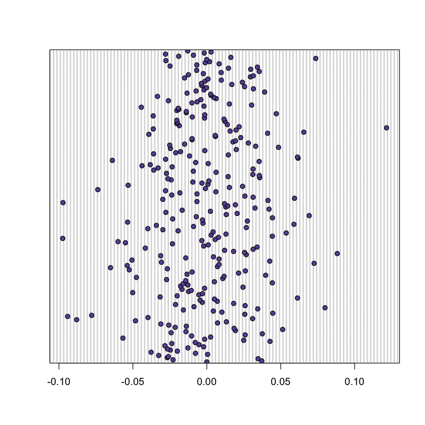
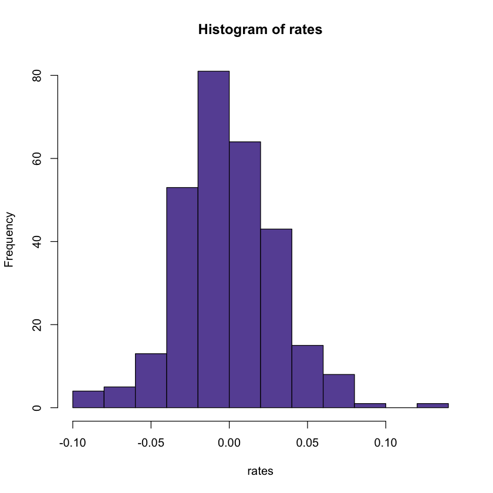

# Мазур Анастасия Вадимовна, 316 группа ВМК МГУ

## 10 APTV Aptiv Consumer Discretionary

**Задание:**

Далее на R или Python

- ✅ Получить данные цен закрытия своего варианта
- ✅ Перейти к доходностям по формуле

$$
r_{t} = \frac{S_{t}}{S_{t−1}} − 1
$$

  &emsp;&emsp;&emsp; Доходности сохраните в переменную `rates`

- ✅ Проверить гипотезу случайности для доходностей. Сделать вывод: Отвергается или нет гипотеза случайности
- ✅ Проверить гипотезу однородности для части данных доходностей до 1 июля 2022 года и последующих. Сделать вывод: Отвергается или нет гипотеза однородности двух частей выборки.
- ✅ Предложить наиболее адекватный тип распределения для доходностей.
  На R это можно сделать так:

```
        d = sort(sample(length(rates), length(rates)*.5))
        head(d)
        #select training sample
        train<-rates[d,]
        test<-rates[-d,]

```

- ✅ Методом максимального правдоподобия оценить параметры предполагаемого распределения по тренировочной части выборки.
  На R для этого можно использовать функцию
  `fitdist(train,distr="chisq",start=list(df=5))`
- ✅ Проверить гипотезу согласия с предложенным распределением всей выборки критериями Колмогорова-Смирнова и Хи-квадрат Пирсона

```R
import pandas as pd

! pip install yfinance # Импорт исторических цен закрытия проводятся из пакета yfinance
import yfinance as yf

import time

import warnings
warnings.filterwarnings("ignore") # Выключаю преждупреждающие сообщения, чтобы не "засорять" вывод
```

Зададим дату начала импорта 2022-01-01

```R
start_day = '2022-01-01'
```

Исторические ежедневные цены закрытия для одного тикера можно получить методом `get_One_Asset()`

```R
def get_One_Asset(company,start_day):
    df = pd.DataFrame()
    returns = yf.Ticker(company)
    data = returns.history(period = "1y", start = start_day)
    df.index = data.index
    df[company] = data.Close
    return df
```

Получим данные в переменную `asset` типа `pd.DataFrame()` и сохраним эти данные в csv файл для импорта в R

```R
company ='APTV'
asset = get_One_Asset(company, start_day)
asset.head()
```


<table border="1" class="dataframe">
  <thead>
    <tr style="text-align: right;">
      <th></th>
      <th>APTV</th>
    </tr>
    <tr>
      <th>Date</th>
      <th></th>
    </tr>
  </thead>
  <tbody>
    <tr>
      <th>2022-01-03 00:00:00-05:00</th>
      <td>166.029999</td>
    </tr>
    <tr>
      <th>2022-01-04 00:00:00-05:00</th>
      <td>172.210007</td>
    </tr>
    <tr>
      <th>2022-01-05 00:00:00-05:00</th>
      <td>168.279999</td>
    </tr>
    <tr>
      <th>2022-01-06 00:00:00-05:00</th>
      <td>174.119995</td>
    </tr>
    <tr>
      <th>2022-01-07 00:00:00-05:00</th>
      <td>169.470001</td>
    </tr>
  </tbody>
</table>
</div>

```R
filename = 'myData.csv'
asset.to_csv(filename, index = True)
```

```R
asset['rates'] = 0
for t in range (1, len(asset.APTV)):
    asset['rates'][t] = (asset.APTV[t] / asset.APTV[t - 1]) - 1
  
asset.to_csv('myData.csv', index = True)
asset.head()
```


<table border="1" class="dataframe">
  <thead>
    <tr style="text-align: right;">
      <th></th>
      <th>APTV</th>
      <th>rates</th>
    </tr>
    <tr>
      <th>Date</th>
      <th></th>
      <th></th>
    </tr>
  </thead>
  <tbody>
    <tr>
      <th>2022-01-03 00:00:00-05:00</th>
      <td>166.029999</td>
      <td>0.000000</td>
    </tr>
    <tr>
      <th>2022-01-04 00:00:00-05:00</th>
      <td>172.210007</td>
      <td>0.037222</td>
    </tr>
    <tr>
      <th>2022-01-05 00:00:00-05:00</th>
      <td>168.279999</td>
      <td>-0.022821</td>
    </tr>
    <tr>
      <th>2022-01-06 00:00:00-05:00</th>
      <td>174.119995</td>
      <td>0.034704</td>
    </tr>
    <tr>
      <th>2022-01-07 00:00:00-05:00</th>
      <td>169.470001</td>
      <td>-0.026706</td>
    </tr>
  </tbody>
</table>
</div>

Далее код на R:

```R
# Выключаю вывод предупреждающих сообщений warning
oldw <- getOption("warn")
options(warn = -1)

# Подгружаю все необходимые библиотеки
library(randtests)
library(dplyr)
library(rriskDistributions)
library(fitdistrplus)
require(MASS)
library(LambertW)
library(ggplot2)
library(vcd)
library(zoo)
```

Выгружаю доходности в отдельную переменную

```R
my_data <- read.csv(file = "./myData.csv", header = TRUE)
rates <- my_data$rates
rates_df <- data.frame(rates)
head(rates_df)
```

<table class="dataframe">
<caption>A data.frame: 6 × 1</caption>
<thead>
	<tr><th></th><th scope=col>rates</th></tr>
	<tr><th></th><th scope=col><dbl></th></tr>
</thead>
<tbody>
	<tr><th scope=row>1</th><td> 0.00000000</td></tr>
	<tr><th scope=row>2</th><td> 0.03722224</td></tr>
	<tr><th scope=row>3</th><td>-0.02282102</td></tr>
	<tr><th scope=row>4</th><td> 0.03470404</td></tr>
	<tr><th scope=row>5</th><td>-0.02670569</td></tr>
	<tr><th scope=row>6</th><td>-0.02596326</td></tr>
</tbody>
</table>

Посмотрим, как выглядят данные по доходностям. Для этого построим точечный график и гистограмму.

```R
dotchart(rates, bg = "#6852A3")
```



```R
hist(rates, col = "#6852A3")
```



<h2>
<span style="color:#6852A3">
Гипотеза случайности
</span>
</h2>

Проверим гипотезу случайности для доходностей.
**Нулевая гипотеза** $H_0$: выборка доходностей является выборкой из независимых наблюдений над некоторой случайной величиной $\xi$
**Альтернативная гипотеза** $H_1$: элементы выборки не являются случайными величинами, то есть они не являются независимыми и не распределены одинаково

Для этого проведём несколько тестов. Уровень статистической значимости: $p\_value = 5 \% = 0.05$

#### 1. Тест Манна-Кендалла

**Тест тренда Манна-Кендалла** используется для определения того, существует ли тренд в данных временного ряда. Это непараметрический тест, означающий, что не делается никаких предположений о нормальности данных.

Гипотезы для теста следующие:
**Нулевая гипотеза** $H_0$: в данных отсутствует тренд (т.е. данные распределены нормально)
**Альтернативная гипотеза** $H_1$: в данных присутствует тенденция (Это может быть как положительная, так и отрицательная тенденция)

```R
rank.test(rates)
```

    Mann-Kendall Rank Test

    data:  rates
    statistic = 1.5563, n = 288, p-value = 0.1196
    alternative hypothesis: trend

Данный тест показал значение $p\_value > 0.05 \Rightarrow $ в данных отсутствует тренд, то есть гипотеза случайности не отвергается.

#### 2. Тест Бартлетта

**Тест Бартлетта** — это статистический тест, который используется для определения того, равны ли дисперсии между несколькими группами (выборками).

Тест Бартлетта использует следующие нулевые и альтернативные гипотезы :

**Нулевая гипотеза** $H_0$: Дисперсия среди каждой группы равна
**Альтернативная гипотеза** $H_1$: По крайней мере, одна группа имеет дисперсию, не равную остальным

```R
bartels.rank.test(rates)
```

    Bartels Ratio Test

    data:  rates
    statistic = -0.30662, n = 288, p-value = 0.7591
    alternative hypothesis: nonrandomness

Данный тест показал значение $p\_value > 0.05 \Rightarrow $ в данных доходностей дисперсии одинаковы для каждой подвыборки, то есть гипотеза случайности не отвергается.

#### 3. Тест случайности Кокса Стюарта

Так же как и тест Манна-Кендалла данный критерий используется для проверки наличия тренда среднего и дисперсии в последовательности наблюдений.

```R
cox.stuart.test(rates)
```

    Cox Stuart test

    data:  rates
    statistic = 74, n = 144, p-value = 0.8027
    alternative hypothesis: non randomness

Данный тест показал значение $p\_value > 0.05 \Rightarrow $ в данных отсутствует тренд, то есть гипотеза случайности не отвергается.

#### 4. Runs test

**Runs test** - это статистический тест, который используется для определения того, получен ли набор данных в результате случайного процесса.

Нулевая и альтернативные гипотезы теста заключаются в следующем:

**Нулевая гипотеза** $H_0$: Данные были получены случайным образом
**Альтернативная гипотеза** $H_1$: Данные не были получены случайным образом

```R
runs.test(rates)
```

    Runs Test

    data:  rates
    statistic = 0.35417, runs = 148, n1 = 144, n2 = 144, n = 288, p-value =
    0.7232
    alternative hypothesis: nonrandomness

Данный тест показал значение $p\_value > 0.05 \Rightarrow $ нулевая гипотеза о случайности данных не отвергается.

#### 5. Turning Point Test

Ещё один тест для проверки случайности данных.

```R
turning.point.test(rates)
```

    Turning Point Test

    data:  rates
    statistic = 0.88791, n = 288, p-value = 0.3746
    alternative hypothesis: non randomness

Данный тест показал значение $p\_value > 0.05 \Rightarrow $ гипотеза случайности не отвергается.

#### Вывод:

Все тесты единогласно говорят о том, что данные о доходностях распределены случайно, тренд отсутствует, дисперсия одинакова для всех групп.

<h2>
<span style="color:#6852A3">
Гипотеза однородности
</span>
</h2>

Проверим однородность данных для части данных доходностей до 1 июля 2022 года и последующих.

**Нулевая гипотеза** $H_0$: В качестве основной гипотезы выдвинем предположение об идентичности функций распределения для двух выборок
**Альтернативная гипотеза** $H_1$: данные в двух выборках распределены не идентично

Уровень статистической значимости: $p\_value = 5 \% = 0.05$

Для этого проведём несколько тестов.

Сначала сформируем две выборки:

```R
sample1 = my_data[my_data["Date"] < '2022-07-01',]
sample2 = my_data[my_data["Date"] >= '2022-07-01',]

tail(sample1)
head(sample2)
```

<table class="dataframe">
<caption>A data.frame: 6 × 3</caption>
<thead>
	<tr><th></th><th scope=col>Date</th><th scope=col>APTV</th><th scope=col>rates</th></tr>
	<tr><th></th><th scope=col><chr></th><th scope=col><dbl></th><th scope=col><dbl></th></tr>
</thead>
<tbody>
	<tr><th scope=row>119</th><td>2022-06-23 00:00:00-04:00</td><td>92.14</td><td> 0.012972739</td></tr>
	<tr><th scope=row>120</th><td>2022-06-24 00:00:00-04:00</td><td>97.09</td><td> 0.053722563</td></tr>
	<tr><th scope=row>121</th><td>2022-06-27 00:00:00-04:00</td><td>97.50</td><td> 0.004222924</td></tr>
	<tr><th scope=row>122</th><td>2022-06-28 00:00:00-04:00</td><td>95.61</td><td>-0.019384609</td></tr>
	<tr><th scope=row>123</th><td>2022-06-29 00:00:00-04:00</td><td>92.77</td><td>-0.029704047</td></tr>
	<tr><th scope=row>124</th><td>2022-06-30 00:00:00-04:00</td><td>89.07</td><td>-0.039883552</td></tr>
</tbody>
</table>

<table class="dataframe">
<caption>A data.frame: 6 × 3</caption>
<thead>
	<tr><th></th><th scope=col>Date</th><th scope=col>APTV</th><th scope=col>rates</th></tr>
	<tr><th></th><th scope=col><chr></th><th scope=col><dbl></th><th scope=col><dbl></th></tr>
</thead>
<tbody>
	<tr><th scope=row>125</th><td>2022-07-01 00:00:00-04:00</td><td>91.45</td><td> 0.026720526</td></tr>
	<tr><th scope=row>126</th><td>2022-07-05 00:00:00-04:00</td><td>90.63</td><td>-0.008966645</td></tr>
	<tr><th scope=row>127</th><td>2022-07-06 00:00:00-04:00</td><td>87.54</td><td>-0.034094631</td></tr>
	<tr><th scope=row>128</th><td>2022-07-07 00:00:00-04:00</td><td>92.70</td><td> 0.058944437</td></tr>
	<tr><th scope=row>129</th><td>2022-07-08 00:00:00-04:00</td><td>92.46</td><td>-0.002588974</td></tr>
	<tr><th scope=row>130</th><td>2022-07-11 00:00:00-04:00</td><td>87.51</td><td>-0.053536632</td></tr>
</tbody>
</table>

Итак, выборки сформированы верно. Видно, что в первой содержатся все записи до 1 июля, а во второй - записи после этой даты.
Однако мы можем видеть, что количество значений в этих таблицах разное: в первой выборке 124 элемента, во второй - 164.
Для корректной работы тестов выбросим некоторые данные из второй таблицы, чтобы размеры выборок были одинаковыми.

```R
nrow(sample1)
nrow(sample2)
```

124

164

```R
size = min(nrow(sample1), nrow(sample2))

ssample1 <- head(sample1$APTV, size)
ssample2 <- head(sample2$APTV, size)

sample1_vec <- as.vector(ssample1)
sample2_vec <- as.vector(ssample2)
```

Данные записаны в переменные в качестве векторов одинаковой длины. Теперь мы можем проводить тесты.

#### 1. Критерий Уилкоксона

```R
wilcox.test(sample1_vec, sample2_vec, paired = T)
```

    Wilcoxon signed rank test with continuity correction

    data:  sample1_vec and sample2_vec
    V = 7198, p-value < 2.2e-16
    alternative hypothesis: true location shift is not equal to 0

Данный тест показал значение $p\_value < 0.05 \Rightarrow $ гипотеза однородности отвергается.

#### 2. Критерий Смирнова

```R
ks.test(sample1_vec, sample2_vec)
```

    Asymptotic two-sample Kolmogorov-Smirnov test

    data:  sample1_vec and sample2_vec
    D = 0.54032, p-value = 3.331e-16
    alternative hypothesis: two-sided

Данный тест показал значение $p\_value < 0.05 \Rightarrow $ гипотеза однородности отвергается.

#### Вывод:

Оба теста говорят о том, что данные о доходностях распределены не идентично, т.е. они не однородны.

<h2>
<span style="color:#6852A3">
Распределение
</span>
</h2>

Попробуем предложить наиболее адекватный тип распределение данных по доходностям.
Для этого воспользуемся функцией `fit.cont()` из библиотеки `rriskDistributions`.

```R
fit.cont(data2fit = rates)
```

    Begin fitting distributions ---------------------------------------

    * fitting normal distribution ... OK

    * fitting Cauchy  distribution ... OK

    * fitting logistic distribution ... OK

    * fitting beta distribution ... failed

    * fitting exponential distribution ... failed

    * fitting chi-square distribution ... failed

    * fitting uniform distribution ... OK

    * fitting gamma distribution ... failed

    * fitting lognormal distribution ... failed

    * fitting Weibull distribution ... failed

    * fitting F-distribution ... failed

    * fitting Student's t-distribution ... OK

    * fitting Gompertz distribution ... failed

    * fitting triangular distribution ... failed

    End fitting distributions -----------------------------------------

    logL      AIC      BIC Chisq(value) Chisq(p) AD(value)        H(AD)
    Normal    587.05 -1170.09 -1162.77        22.94     0.06      0.75 not rejected
    Cauchy    551.25  -1098.5 -1091.17        67.46     0.00      3.43     rejected
    Logistic  591.11 -1178.22 -1170.89        19.91     0.13      0.32 not rejected
    Uniform     NULL     NULL     NULL        62.51     0.00       Inf         NULL
    Student  -265.13   532.26   535.92      7051.60     0.00    103.46         NULL
             KS(value)        H(KS)
    Normal        0.05 not rejected
    Cauchy        0.07 not rejected
    Logistic      0.03 not rejected
    Uniform       0.11     rejected
    Student       0.46     rejected
    Error in title(main = main, sub = sub, xlab = xlab, ylab = ylab, ...) :
      не могу найти никаких шрифтов X11
    Проверьте, правильно ли указан Font Path.

    Chosen continuous distribution is: Normal (norm)
    Fitted parameters are:
             mean            sd
    -0.0007790068  0.0315149064

Тест Колмогорова-Смирнова (**H(KS)** в таблице) не отвергает 3 распределения:

- Нормальное
- Коши
- Логистическое

Тест Андерсона Дарлинга (**H(AD)** в таблице) не отвергает 2 распределения:

- Нормальное
- Логистическое

$p\_value$ в тесте $\chi$-квадрат (**Chisq(p)** в таблице) $> 0.05$ для 2 распределений:

- Нормальное
- Логистическое

Взглянем на графики:

</img>

</img>

</img>

График распределения Коши имеет более острую вершину. Отклоняем это распределение для наших данных.
Чтобы выбрать наиболее подходящее распределение между Нормальным и Логистическим обратимся к значению критерия Акаике (**AIC** в таблице). Лучшая модель соответствует минимальному значению критерия Акаике. В нашем случае наименьшее значение достигается при Логистической модели распределения, хотя отличия с Нормальным не так существенны.

#### Вывод:

Предложение: данные по доходностям распределены согласно логистическому закону.

<h2>
<span style="color:#6852A3">
Метод максимального правдоподобия
</span>
</h2>

С помощью метода максимального правдоподобия оценим параметры предполагаемого распределения (логистическое) по тренировочной части выборки.

```R
d = sort(sample(nrow(rates_df), nrow(rates_df)*.5))
head(d)
#select training sample
train<-rates[d]
test<-rates[-d]

head(data.frame(train))
head(data.frame(test))
```

<style>
.list-inline {list-style: none; margin:0; padding: 0}
.list-inline>li {display: inline-block}
.list-inline>li:not(:last-child)::after {content: "\00b7"; padding: 0 .5ex}
</style>

<ol class=list-inline><li>7</li><li>8</li><li>13</li><li>20</li><li>23</li><li>25</li></ol>

<table class="dataframe">
<caption>A data.frame: 6 × 1</caption>
<thead>
	<tr><th></th><th scope=col>train</th></tr>
	<tr><th></th><th scope=col><dbl></th></tr>
</thead>
<tbody>
	<tr><th scope=row>1</th><td>-0.0325317147</td></tr>
	<tr><th scope=row>2</th><td> 0.0005635337</td></tr>
	<tr><th scope=row>3</th><td>-0.0265972358</td></tr>
	<tr><th scope=row>4</th><td> 0.0427546670</td></tr>
	<tr><th scope=row>5</th><td>-0.0567278994</td></tr>
	<tr><th scope=row>6</th><td>-0.0102874481</td></tr>
</tbody>
</table>

<table class="dataframe">
<caption>A data.frame: 6 × 1</caption>
<thead>
	<tr><th></th><th scope=col>test</th></tr>
	<tr><th></th><th scope=col><dbl></th></tr>
</thead>
<tbody>
	<tr><th scope=row>1</th><td> 0.00000000</td></tr>
	<tr><th scope=row>2</th><td> 0.03722224</td></tr>
	<tr><th scope=row>3</th><td>-0.02282102</td></tr>
	<tr><th scope=row>4</th><td> 0.03470404</td></tr>
	<tr><th scope=row>5</th><td>-0.02670569</td></tr>
	<tr><th scope=row>6</th><td>-0.02596326</td></tr>
</tbody>
</table>

```R
fitting_logis <- fitdist(train, distr = "logis")
summary(fitting_logis)
```

    Fitting of the distribution ' logis ' by maximum likelihood
    Parameters :
                 estimate  Std. Error
    location -0.001076471 0.002513532
    scale     0.017553615 0.001221421
    Loglikelihood:  292.5624   AIC:  -581.1247   BIC:  -575.1851
    Correlation matrix:
                location       scale
    location 1.000000000 0.005448053
    scale    0.005448053 1.000000000

<h2>
<span style="color:#6852A3">
Гипотеза согласия
</span>
</h2>

#### 1. Тест Колмогорова-Смирнова

Проверим гипотезу согласия с полученным ранее распредением с помощью теста Колмогорова-Смирнова.

- на тестовой выборке:

```R
ks.test(test, fitting_logis$estimate)
```

    Exact two-sample Kolmogorov-Smirnov test

    data:  test and fitting_logis$estimate
    D = 0.53472, p-value = 0.4433
    alternative hypothesis: two-sided

- на всей выборке:

```R
ks.test(rates, fitting_logis$estimate)
```

    Exact two-sample Kolmogorov-Smirnov test

    data:  rates and fitting_logis$estimate
    D = 0.52431, p-value = 0.4577
    alternative hypothesis: two-sided

Гипотеза согласия не отвергается.

#### 2. Тест $\chi$-квадрат Пирсона

Вспомним, какие параметры для логистического распределения мы получили на тренировочных данных:

```R
fitting_logis
location <- fitting_logis$estimate[1]
scale <- fitting_logis$estimate[2]
```

    Fitting of the distribution ' logis ' by maximum likelihood
    Parameters:
                 estimate  Std. Error
    location -0.001076471 0.002513532
    scale     0.017553615 0.001221421
